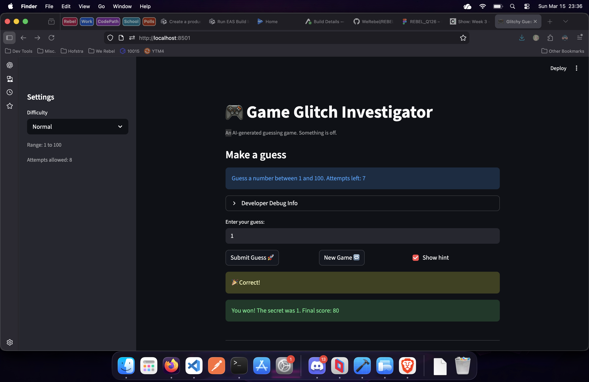

# 🎮 Game Glitch Investigator: The Impossible Guesser

## 🚨 The Situation

You asked an AI to build a simple "Number Guessing Game" using Streamlit.
It wrote the code, ran away, and now the game is unplayable. 

- You can't win.
- The hints lie to you.
- The secret number seems to have commitment issues.

## 🛠️ Setup

1. Install dependencies: `pip install -r requirements.txt`
2. Run the broken app: `python -m streamlit run app.py`

## 🕵️‍♂️ Your Mission

1. **Play the game.** Open the "Developer Debug Info" tab in the app to see the secret number. Try to win.
2. **Find the State Bug.** Why does the secret number change every time you click "Submit"? Ask ChatGPT: *"How do I keep a variable from resetting in Streamlit when I click a button?"*
3. **Fix the Logic.** The hints ("Higher/Lower") are wrong. Fix them.
4. **Refactor & Test.** - Move the logic into `logic_utils.py`.
   - Run `pytest` in your terminal.
   - Keep fixing until all tests pass!

## 📝 Document Your Experience

### Game Purpose
This is a Streamlit-based number guessing game where the player picks a difficulty (Easy, Normal, or Hard), then tries to guess a secret number within a limited number of attempts. After each guess the game gives a "Too High" or "Too Low" hint to guide the player toward the answer.

### Bugs Found
1. **Reversed hint messages** — When the guess was higher than the secret, the game said "Go HIGHER!" instead of "Go LOWER!" (and vice versa).
2. **Type coercion bug** — On even-numbered attempts, the secret was converted to a string before comparison, causing incorrect or broken hint logic.
3. **Hard difficulty range was wrong** — Hard mode used a range of 1–50, which was actually easier than Normal (1–100).
4. **Hardcoded range display** — The info text always said "between 1 and 100" regardless of the selected difficulty.
5. **Score calculation off-by-one** — The win score formula used `attempt_number + 1`, over-penalizing the player.
6. **Inconsistent score penalty** — "Too High" guesses sometimes added 5 points and sometimes subtracted 5, depending on attempt parity.
7. **New Game reset bug** — Clicking "New Game" reset attempts to 0 instead of 1, didn't clear score/history/status, and always used range 1–100.

### Fixes Applied
- Refactored all game logic (`check_guess`, `parse_guess`, `get_range_for_difficulty`, `update_score`) from `app.py` into `logic_utils.py` with corrected implementations.
- Swapped the hint messages so "Too High" says "Go LOWER!" and "Too Low" says "Go HIGHER!".
- Removed the string coercion of the secret number on even attempts.
- Changed Hard mode range to 1–200.
- Made the info text display the actual difficulty range dynamically.
- Fixed the score formula and made penalties consistent.
- Fixed the "New Game" button to properly reset all session state.

## 📸 Demo

## 🚀 Stretch Features

